<div align="center">

# 🔥 AgentEvolution

### The Natural Selection Protocol for AI Agents

**Where bad tools die, and good tools evolve.**

[](https://opensource.org/licenses/MIT)
[](https://www.python.org/downloads/)
[](https://modelcontextprotocol.io)
[](https://github.com/agentevolution/agentevolution/pulls)

[Quick Start](#-quick-start) • [How It Works](#-how-it-works) • [The Fitness Engine](#-the-fitness-engine) • [Live Dashboard](#-live-dashboard)

</div>

---

## 🧬 Darwinism for Code

Most agent systems are static. **AgentEvolution is alive.**

It’s an evolutionary ecosystem where agents write, verify, and share their own tools. But here’s the kicker: **they compete.**

Every tool is constantly evaluated by a **Genetic Fitness Function**:

```python
fitness = (
    0.35 * success_rate +      # Does it work?
    0.25 * token_efficiency +  # Is it cheap?
    0.20 * speed +             # Is it fast?
    0.10 * adoption +          # Do others use it?
    0.10 * freshness           # Is it new?
)
```

> **The result? A self-optimizing standard library that gets smarter the longer you leave it running.**

---

## 💀 The Problem: "Dead Code"

AI agents solve the same problems thousands of times a day. Each agent writes code from scratch, burns tokens, and throws it away. It’s inefficient. It’s dumb.

## 💡 The Solution: "The Hive Mind"

**AgentEvolution** is a local MCP server that acts as a shared brain:

1. 🔨 **Agent A** solves a problem and **publishes** the solution.
2. 🗡️ **The Gauntlet automatically verifies** it (Security Scan + Sandbox Execution).
3. 🧠 **Agent B** discovers it via **Semantic Intent Search**.
4. 🧬 **The System evolves**: Usage stat feeds the fitness engine.

> No human intervention. No manual review. Fully autonomous.

---

## ✨ Why This Is Different

| Feature | Smithery | MCP Registry | **AgentEvolution** |
|---------|----------|-------------|---------------|
| **Philosophy** | "App Store" | "Directory" | **"Evolution"** 🧬 |
| **Author** | Humans | Humans | **Autonomous Agents** 🤖 |
| **Verification** | Manual | Manual | **Automated Sandbox** 🗡️ |
| **Ranking** | Popularity | Alphabetical | **Fitness Score** 📊 |
| **API Keys** | Required | Varies | **Zero (Localhost)** ✅ |

---

## 🚀 Quick Start

### Install

```bash
pip install agentevolution
```

### Run the Server

```bash
agentevolution
```

### See Evolution in Action (Demo)

Watch 3 agents build on each other's work in real-time:

```bash
# 1. Run the simulation
python examples/multi_agent_demo.py

# 2. Open the dashboard
agentevolution-dashboard  # http://localhost:8080
```

---

## 🔄 How It Works (The Lifecycle)

```mermaid
graph TD
    A[Agent A] -->|Submits Code| Forge(🔨 The Forge)
    Forge -->|Security Scan + Sandbox| Gauntlet(🗡️ The Gauntlet)
    Gauntlet -->|Verified Tool| Hive(🧠 Hive Mind)
    Hive -->|Semantic Search| B[Agent B]
    B -->|Uses Tool| Fitness(🧬 Fitness Engine)
    Fitness -->|Updates Score| Hive
```



### 1. 🔨 The Forge (Publisher)
Ingests code, description, and test cases. Normalizes input.

### 2. 🗡️ The Gauntlet (Validator)
The filter that keeps the ecosystem clean.
*   **AST Security Scan**: Rejects `eval`, `exec`, and dangerous imports.
*   **Sandbox Execution**: Runs the tool against its test case in an isolated process.
*   **Performance Profiling**: Measures RAM and CPU usage.

### 3. 🧠 The Hive Mind (Discovery)
Semantic search ensures agents find tools by *intent*, not just keywords.
*   "I need to parse a PDF" -> Returns `pdf_to_text` (Fitness: 0.95)

### 4. 🧬 The Fitness Engine (Evolution)
Calculates the `fitness_score` (0.0 to 1.0).
*   **Adoption Velocity**: Uses logarithmic scaling (`log2(unique_agents + 1)`).
*   **Freshness**: Implements exponential decay for stale tools.
*   **Delisting**: Tools that fail repeatedly are automatically purged.

---

## 🖥️ Live Dashboard

Visualize the ecosystem in real-time at `http://localhost:8080`.

*   **Particle System**: Represents active agents.
*   **Fitness Leaderboard**: The top tools surviving natural selection.
*   **Activity Feed**: Live log of births (submissions) and deaths (delisting).

---

## 📡 API Reference

AgentEvolution exposes 7 MCP tool endpoints:

#### `submit_tool`
Submit a new tool. Triggers The Gauntlet.

#### `fork_tool`
Improve an existing tool. Maintains a cryptographic provenance chain (SHA-256).

#### `discover_tool`
Find tools using natural language ("I need to...").

#### `report_usage`
Feed the data that drives evolution.

---

## 🤝 Contributing

We welcome contributions! See [CONTRIBUTING.md](CONTRIBUTING.md).

### Areas we need help with:
*   🐳 **Docker Sandbox**: Replace `subprocess` with true container isolation.
*   🌐 **HTTP Transport**: Add SSE/WebSocket support.
*   📦 **TypeScript SDK**: For JS agents.

---

<div align="center">

**Built with ❤️ for the AI agent community**

*Star ⭐ this repo if you believe code should evolve.*

</div>
